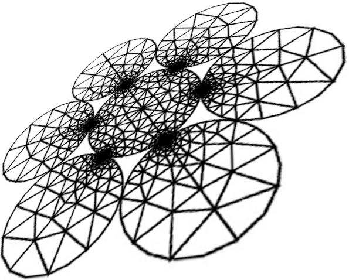

.. waveguicsx documentation master file, created by
   sphinx-quickstart on Fri Oct 13 20:37:01 2023.
   You can adapt this file completely to your liking, but it should at least
   contain the root `toctree` directive.

Welcome to waveguicsx's documentation!
======================================

   
.. toctree::
   :maxdepth: 2
   :caption: Contents:

   readme_link
   modules

