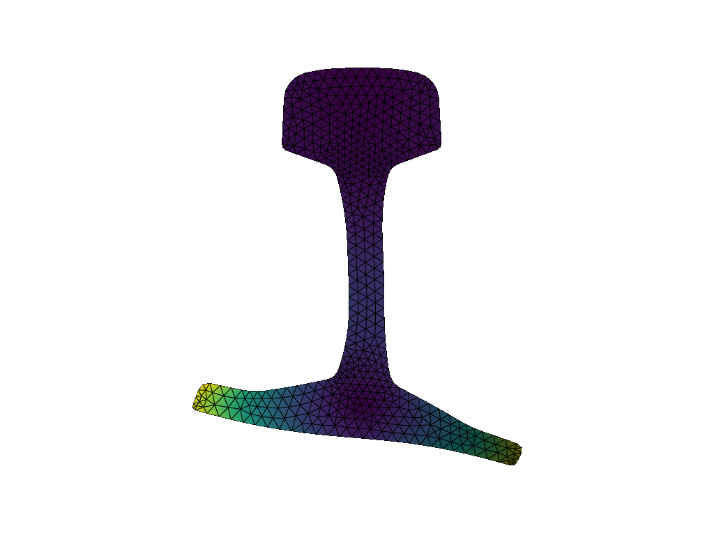
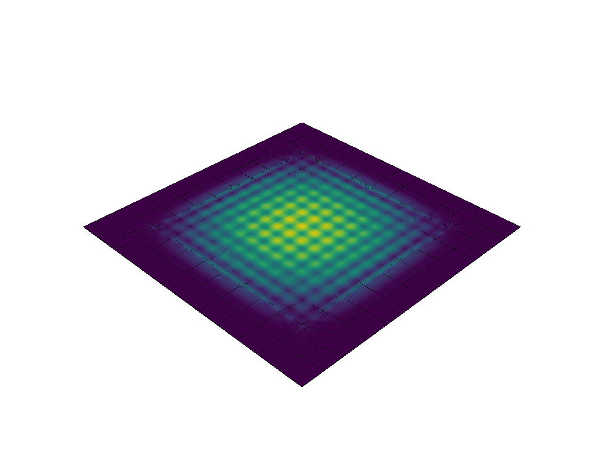

.. waveguicsx documentation master file, created by
   sphinx-quickstart on Fri Oct 13 20:37:01 2023.
   You can adapt this file completely to your liking, but it should at least
   contain the root `toctree` directive.

Waveguicsx - Version |__version__|
==================================

.. image:: logo.png
   :alt: Image
   :scale: 25%
   :align: center

.. image:: rail_phase_velocity.png
   :alt: Image
   :scale: 45%

.. image:: buried_bar_attenuation.png
   :alt: Image
   :scale: 45%

.. image:: plate_zgv_transient.png
   :alt: Image
   :scale: 50%
   :align: center

.. toctree::
   :maxdepth: 4
   :caption: Contents:

   readme_link
   modules
   examples

